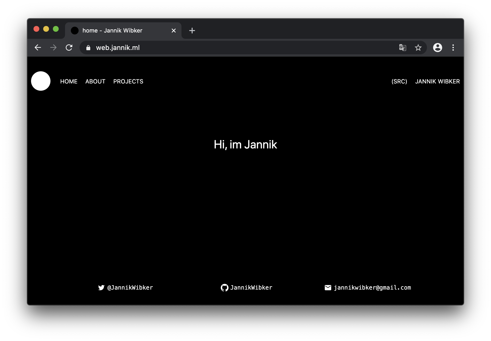

# Personal website (v2)




## Building and running

Development:

```sh
npm run dev # node main.js dev
```

Building:

```sh
npm run build # next build
```

Starting (when already built):

```sh
npm run start # node main.js
```